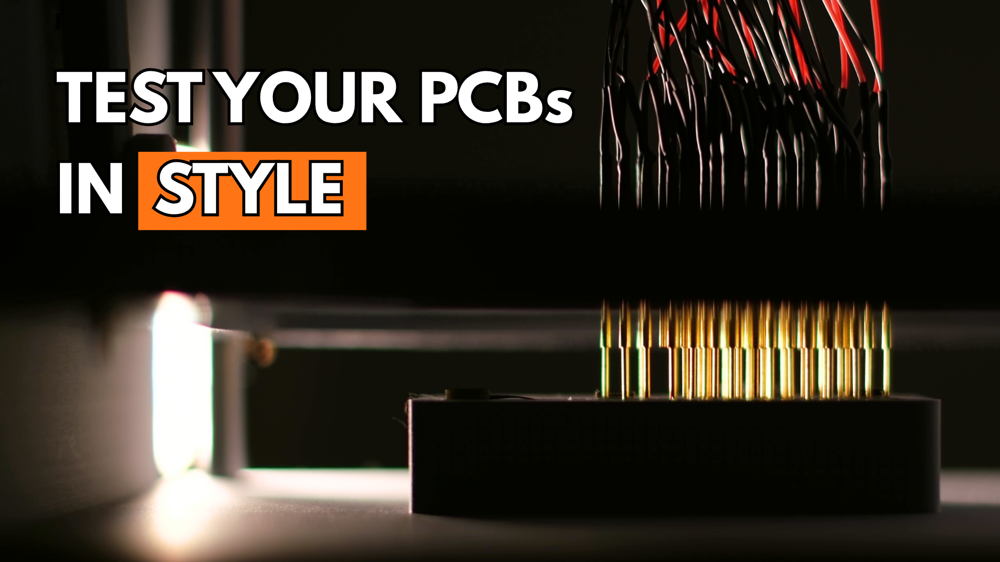
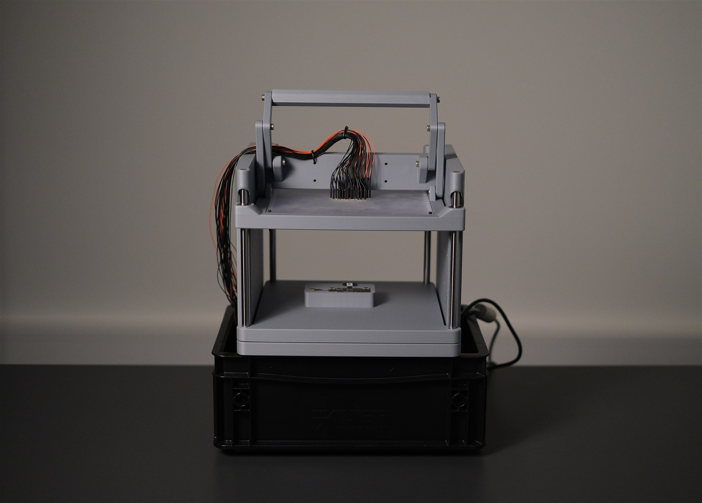
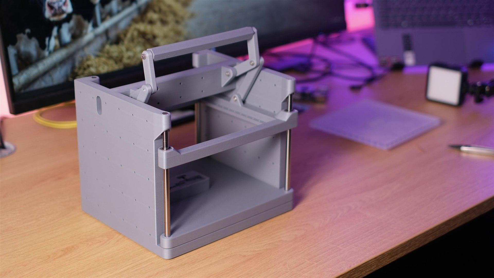

# Stop Testing Circuit Boards by Hand. Build This.

**A 3D-printable pogo-pin test fixture for PCBs — built for around $67.**

---

## 🔍 What Is This?

A 3D-printable **pogo-pin test fixture (test jig)** for PCBs. Instead of pressing probes onto a board by hand - or paying hundreds for a commercial fixture - you drop the board into the jig, pull the handle, and a spring-loaded **needle plate** presses gold-plated pogo pins onto the test points. Contact stays put hands-free, so you can measure, probe, or run a full functional test.

- 🧭 The **needle plate** rides on 4 linear ball bearings along hardened 8 mm shafts, so it lands in exactly the same position on every stroke
- 🕹️ A **lever mechanism with a handle** presses the plate down and lifts it off cleanly
- 🔌 **RL75-4S receptacles** in the needle plate let you swap pogo pins quickly — run wires from them to your multimeter, power supply, scope, or a custom test rig
- 🧩 The **PCB socket plate** can be adapted to whatever board you need to test

Built to fit Bambulab X1C build plate, with an all-in parts cost of roughly **$67** (excluding the printer).

---

## 🖼️ Gallery

  
  

<em>The finished jig with the needle plate wired up and a close-up of the lever mechanism that presses it down.</em>

---

## 📦 What's in `parts/`

All models are standard STEP files and print-ready. Open [`assembly.stp`](parts/assembly.stp) to see everything mated.

| File | What it is | Type |
| --- | --- | --- |
| [`assembly.stp`](parts/assembly.stp) | Complete assembly — check fit and orientation before printing | Assembly |
| [`frame.stp`](parts/frame.stp) | Frame that carries the shafts and lever mechanism | 🖨️ Print |
| [`handle.stp`](parts/handle.stp) | Handle for the lever mechanism | 🖨️ Print |
| [`upper_arm_left.stp`](parts/upper_arm_left.stp) | Upper lever arm, left | 🖨️ Print |
| [`upper_arm_right.stp`](parts/upper_arm_right.stp) | Upper lever arm, right | 🖨️ Print |
| [`lower_arm_left.stp`](parts/lower_arm_left.stp) | Lower lever arm, left | 🖨️ Print |
| [`lower_arm_right.stp`](parts/lower_arm_right.stp) | Lower lever arm, right | 🖨️ Print |
| [`needle_plate.stp`](parts/needle_plate.stp) | Needle plate — carries the pogo pins | 🖨️ Print or CNC mill |
| [`needle_plate_holder.stp`](parts/needle_plate_holder.stp) | Holder that keeps the needle plate aligned | 🖨️ Print |
| [`pcb_socket_plate.stp`](parts/pcb_socket_plate.stp) | PCB socket plate — adapt this one for your board | 🖨️ Print |
| [`MOD-F07521S064Lxxx.stp`](parts/MOD-F07521S064Lxxx.stp) | PAL75-Q1 pogo pin (Ø 1.02 × 33 mm) | Off-the-shelf |
| [`MOD-H075LA-7.6.stp`](parts/MOD-H075LA-7.6.stp) | RL75-4S receptacle for the pogo pins | Off-the-shelf |

---

## 🛠️ Parts List

| Qty | Part | Spec | Where to buy |
| --- | --- | --- | --- |
| 4 | Linear motion shafts | 8 mm, H6, 200 mm, CF53 | [Dold Mechatronik](https://www.dold-mechatronik.de/Praezisionswelle-8mm-h6-geschliffen-und-gehaertet-Material-CF53-Zuschnitt) |
| 4 | Linear ball bearings | 8 mm, e.g. KH0824-PP | [Dold Mechatronik](https://www.dold-mechatronik.de/Kompakt-Linearkugellager-KH0824-PP) |
| as needed | M3 brass heat-set inserts | length depending on your inserts | — |
| 4 | M3 shoulder screws | 4 × 4 mm | — |
| 4 | M3 shoulder screws | 4 × 8 mm | — |
| as needed | RL75-4S receptacles | pogo-pin sleeves | [AliExpress](https://www.aliexpress.com/item/1005012048515242.html) |
| as needed | PAL75-Q1 pogo pins | gold-plated spring probes | [AliExpress](https://www.aliexpress.com/item/1005002107239260.html) |

> Availability and prices on AliExpress vary by region. The links above are examples, not endorsements.

---

## 🔗 Links

- 🎬 **Companion video:** [Stop Testing Circuit Boards by Hand. Build This.](https://youtu.be/ITH-iNQU9S0)
- 🖨️ **Original open-source frame:** [PCB test jig by Vajdera on Printables](https://www.printables.com/model/1097757-pcb-test-jig)
- 🐛 **Questions & issues:** [open an issue](https://github.com/nktbuilds/TestJig/issues)

---

## 📜 License

This project is released under [CC0 1.0](LICENSE) — public domain. Print it, remix it, sell it, no attribution required.